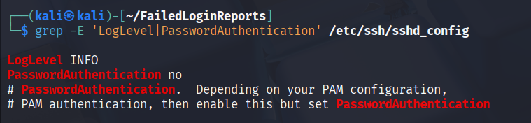
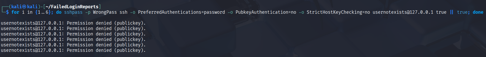
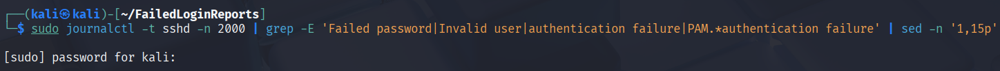
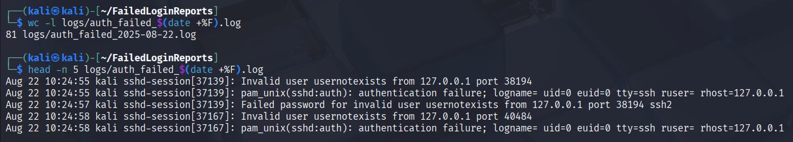
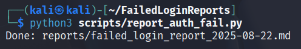
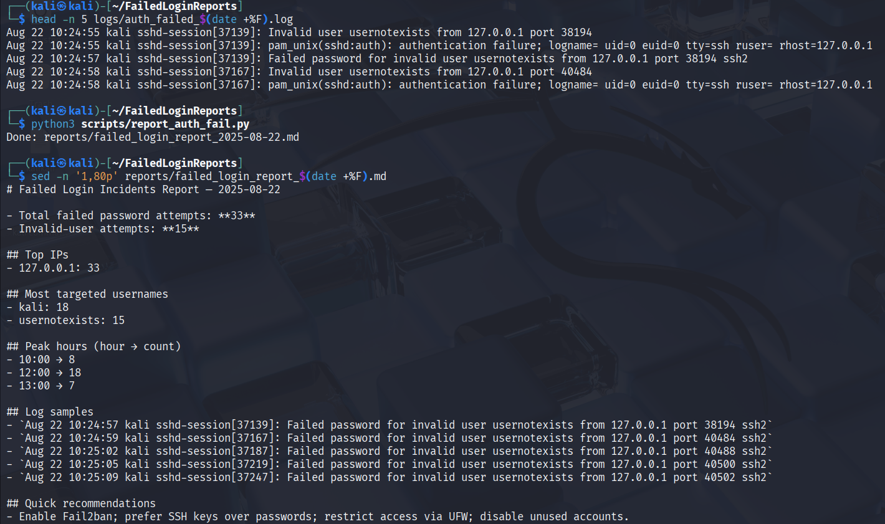
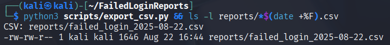
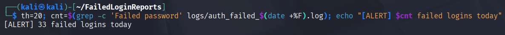
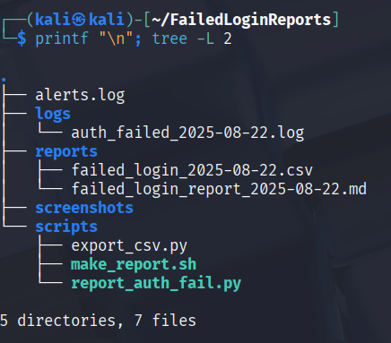
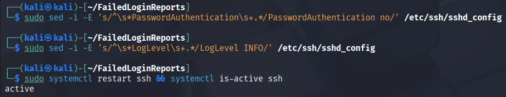

# failed-login-reports# Failed Login Incidents (SSH) — Daily Report
Parses `journalctl` → outputs Markdown + CSV → simple threshold alert.
Includes scripts, sample report, and screenshots.
## Quick start
```bash
sudo journalctl -t sshd -n 2000 | \
  grep -E 'Failed password|Invalid user|authentication failure|PAM.*authentication failure' \
  > logs/auth_failed_$(date +%F).log

python3 scripts/report_auth_fail.py
python3 scripts/export_csv.py
```

## Structure
failed-login-reports/
├─ scripts/
├─ reports/
└─ screenshots/

- Fail2ban (sshd jail), UFW allow-list, cron schedule.

## Artifacts (2025-08-22)
- [Markdown report](reports/failed_login_report_2025-08-22.md)
- [CSV export](reports/failed_login_2025-08-22.csv)
- [PDF](reports/Failed_Login_Incidents_2025-08-22.pdf)

## Screenshots
<details><summary><b>01 — SSHD config (INFO, keys-only)</b></summary>
<p></p>
</details>

<details><summary><b>02 — Generate failed attempts</b></summary>
<p></p>
</details>

<details><summary><b>03 — Raw sample (journalctl)</b></summary>
<p></p>
</details>

<details><summary><b>04 — Raw count & head</b></summary>
<p></p>
</details>

<details><summary><b>05 — Run report script</b></summary>
<p></p>
</details>

<details><summary><b>06 — Markdown report preview</b></summary>
<p></p>
</details>

<details><summary><b>07 — CSV export</b></summary>
<p></p>
</details>

<details><summary><b>08 — Threshold alert</b></summary>
<p></p>
</details>

<details><summary><b>09 — Project structure</b></summary>
<p></p>
</details>

<details><summary><b>10 — Harden back (keys-only)</b></summary>
<p></p>
</details>

## Release
- **v0.1.0** — first public release: [download (PDF/MD/CSV)](https://github.com/Mohaned87/failed-login-reports/releases/tag/v0.1.0)
